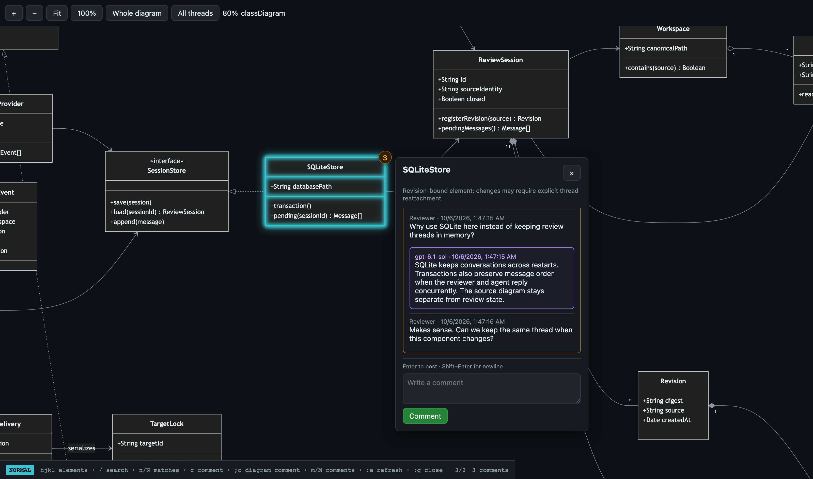

# mmdr — Mermaid review



*Illustrative UML review: each component has its own conversation.*

Local, keyboard-first diagram conversations with agents. Render Mermaid as
SVG, attach comments to elements, and receive agent replies in the diagram.
GitHub-dark UI, offline assets, live source reload, and persistent chats.

## Install

Requires Python 3.11+ and [uv](https://docs.astral.sh/uv/). Node is needed only
for asset builds and browser tests, not for viewing diagrams.

As a Copilot plugin, after publication:

```console
copilot plugin install ztnel/mmdr
```

Other MCP hosts can launch the same server without the plugin:

```console
uv run --frozen --project /path/to/mmdr mmdr-mcp --workspace /path/to/project
```

Use stdio transport. Repeat `--workspace` to grant additional directories.
Only files inside these grants can be opened. Without startup grants,
`open_review` requires an explicit `workspace` authorized by the human.
Tool calls cannot widen configured startup grants. Sessions must be opened
by the current connection before its tools can access them.

The plugin uses `${PLUGIN_ROOT}` to locate the package, not the project.
Its skill supplies the authorized project as `workspace`; it never assumes
the MCP process's working directory is the project. The server does not depend on tmux,
Copilot identities, or the agents repository.

## Agent tools

| Tool | Purpose |
|---|---|
| `open_review` | Open/reuse `.mmd` or a selected Markdown block; returns session and local URL |
| `read_comments` | Source/revision context, all threads, pending human messages |
| `reply` | Respond to a human message in its original thread |
| `wait_for_feedback` | Wait 1–300 seconds for feedback, timeout, or closure |
| `close_review` | Preserve conversations and end commenting; never approve code |

Waiting occupies a tool call; it does not wake an idle agent. Use an explicit
review loop or a dedicated review agent. The green status dot means an agent
is currently waiting through MCP—not merely that an agent once connected.
External wake integrations are separate and must not deliver duplicate work
to an agent already waiting.

The MCP process owns its browser servers; disconnecting stops those servers,
but conversations persist in the platform's user state directory. Reopening
resumes the saved review. Server reuse is scoped to one MCP connection;
separate connections have separate browser servers. Do not share the
capability-bearing browser URL.

## Standalone viewer

```console
uv run --frozen mmdr open diagram.mmd --workspace .
```

Runs until interrupted. Use `--block <heading-or-marker>` for Markdown with
multiple diagrams. Marker syntax: `<!-- mermaid-review: unique-id -->`.
`--state-dir` before the operation selects another store.

## Keyboard

`hjkl` selects directionally (sequence fallback), `/` searches, `n/N` cycles
matches, `c` composes, `;c` comments on the whole diagram, `m/M` cycles messages.
Enter posts; Shift+Enter inserts a newline. Escape exits typing.
`:e` re-renders; `:q`, `:wq`, and `:x` close commenting, not the browser tab.

Flowchart node IDs retain comments across revisions. Other elements are
revision-bound and require explicit reattachment after changes. Parse errors
retain the last valid diagram. Legacy state syntax uses the current compatible
state renderer; original source is untouched.

## Development

```console
uv sync --frozen
uv run --frozen pytest
npm ci
npx playwright install chromium
uv run --frozen python scripts/browser_tests.py
uv build
uv run --frozen python scripts/check_package.py
```

Browser tests cover all 38 registered types in Mermaid 11.17.2, offline
rendering, chat, keyboard navigation, and revisions. Rebuild pinned browser
assets with `uv run python scripts/build_assets.py`; license notices ship
alongside the bundle. CI exercises Python tests on Windows, macOS, and Linux.

MIT licensed. Vendored dependencies retain their notices in
`src/mmdr/assets/vendor/THIRD-PARTY.txt`. Publication is pending human review.
